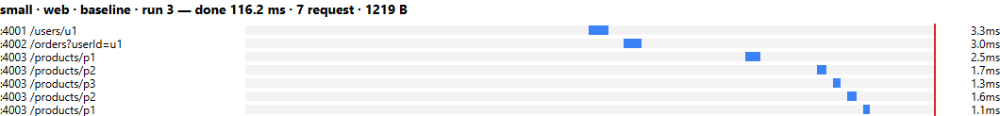
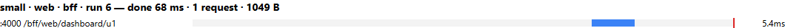
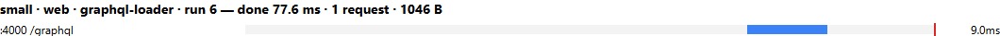
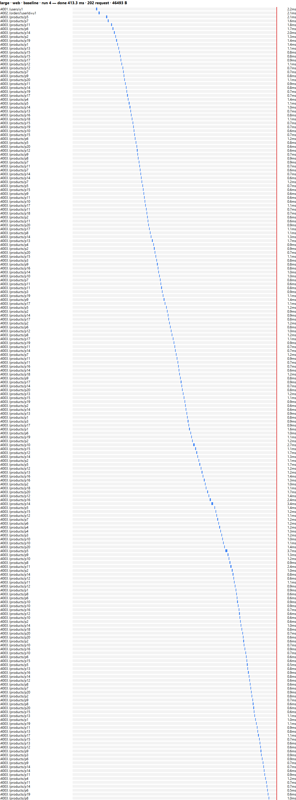
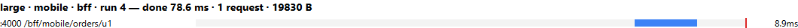
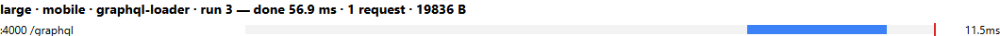
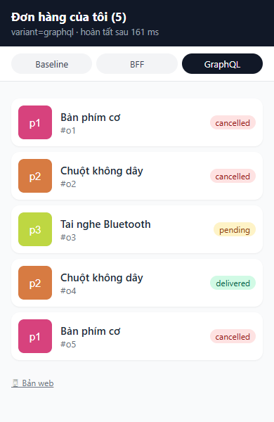

# Báo cáo: API Composition với Baseline REST, BFF và GraphQL

*Web nâng cao, tuần 2, block 2. Toàn bộ số liệu là kết quả chạy thật trên máy của nhóm (Windows 11, Node 26, Microsoft Edge) ngày 2026-10-08. Cách chạy lại có trong `README.md`.*

---

## 1. Bài toán và kết quả cuối cùng

Có **hai loại client dùng chung dữ liệu**, nằm ở **ba service độc lập**. Mỗi service có CSDL riêng, ở đây là một file JSON riêng.

| Client | Cần hiển thị |
|---|---|
| Dashboard web | Tên user, danh sách đơn đầy đủ field (mã, số lượng, đơn giá, trạng thái, ngày) và tên product |
| App mobile | Danh sách đơn, mỗi đơn chỉ cần mã đơn, trạng thái, tên product và thumbnail |

Nhóm dựng **ba biến thể**. Cả ba đọc cùng ba service, chỉ khác **nơi ghép dữ liệu**:

| Biến thể | Nơi ghép | Web gọi | Mobile gọi |
|---|---|---|---|
| **Baseline** | Browser | `GET /users/u1`, `GET /orders?userId=u1`, rồi `GET /products/:id` cho từng đơn (tuần tự) | Giống web, rồi tự cắt bớt field |
| **BFF** | Gateway, mỗi client một endpoint | `GET /bff/web/dashboard/u1` | `GET /bff/mobile/orders/u1` |
| **GraphQL** | Gateway, một endpoint cho mọi client | `POST /graphql` với query `Dashboard` | `POST /graphql` với query `MobileOrders` |

**Tiêu chí đạt của đề và kết quả:**

| Tiêu chí | Kết quả | Bằng chứng |
|---|---|---|
| Baseline, BFF và GraphQL trả cùng dữ liệu dashboard cho cùng user | ✅ Đạt, cả web lẫn mobile, cả bộ small và large | `npm run verify` → `results/verify.txt` (so sánh bằng `deepStrictEqual`) |
| Ở BFF và GraphQL, response mobile chỉ chứa field mobile cần | ✅ Đạt: chỉ có `id`, `status`, `product.name`, `product.thumbnail` | test `BFF mobile…`, `GraphQL MobileOrders…`; `verify` kiểm tra đúng tập key |
| Sau khi sửa N+1, số call tới Product Service không tăng theo số đơn | ✅ Đạt: naive 5 → 200 call; DataLoader **1 → 1 call** | `results/trace-graphql-*.log`, `results/summary.md` |
| Product chậm hoặc lỗi: một policy chung, không bịa dữ liệu | ✅ Trả dữ liệu một phần, đánh dấu lỗi theo từng đơn, timeout 1 s | `verify` phần fault; test `product chậm hơn timeout…` |
| Số liệu là kết quả chạy thật | ✅ 96 lần đo, ghi từng lần | `results/raw.csv` |

---

## 2. Kiến trúc

```
            ┌───────────────────────── gateway :4000 (Express) ─────────────────────────┐
browser ────┤ static: dashboard.html (web), mobile.html (mobile), /thumbs/*.svg          │
(web/mobile)│ GET  /bff/web/dashboard/:userId     ─┐                                     │
            │ GET  /bff/mobile/orders/:userId     ─┼─ BFF    (gateway/bff.js)            │
            │ POST /graphql  (Dashboard | MobileOrders) ── GraphQL (gateway/graphql.js)  │
            └───────────────────────────────┬────────────────────────────────────────────┘
   baseline: browser gọi thẳng (CORS)       │ fetch + x-request-id
            ▼                               ▼
   user-service :4001  ← data/<ds>/users.json
   order-service :4002 ← data/<ds>/orders.json
   product-service :4003 ← data/<ds>/products.json   (có GET /products?ids=a,b,c để lấy theo lô)
```

| Thư mục | Vai trò |
|---|---|
| `services/{user,order,product}` | Ba service REST độc lập, mỗi service đọc đúng một file JSON |
| `shared/service.js` | Khung chung cho service: CORS, bộ đếm `calls` và `dbQueries`, log trace |
| `shared/contract.js` | View-model, định dạng lỗi, hai query GraphQL. **Dùng chung cho browser và Node** |
| `gateway/` | BFF (`bff.js`), GraphQL + DataLoader (`graphql.js`), client gọi service (`clients.js`) |
| `web/` | `dashboard.html`/`app.js` (web), `mobile.html`/`mobile.js` (mobile), `fetchers.js` (3 biến thể × 2 client) |
| `scripts/` | `seed`, `smoke`, `trace`, `verify`, `bench`, `report` |
| `tests/` | 24 test `node:test` (unit + integration) |
| `results/` | Kết quả đo thật: CSV, bảng tổng hợp, waterfall, trace |

---

## 3. Các lựa chọn của nhóm và lý do

Mỗi mục dưới đây trả lời ba câu: nhóm **chọn** gì, **vì sao**, và **vì sao không chọn** các phương án khác.

### 3.1. Runtime và framework: Node.js 26 + Express 5

**Chọn Node.js + Express** vì:
- Cả ba service, gateway và trang web đều viết bằng **cùng một ngôn ngữ**. Nhờ vậy `shared/contract.js` (view-model, định dạng lỗi, query GraphQL) chạy được **cả trên browser lẫn server**. Ba biến thể và hai client dùng chung một định nghĩa dữ liệu, nên phép so sánh không bị lệch vì mỗi bên ghép dữ liệu một kiểu.
- Node 26 có sẵn `fetch`, `AbortSignal.timeout`, `node:test` và `import.meta.main`. Không cần thêm axios, Jest hay ts-node.
- Express là framework HTTP phổ biến nhất của Node, mỗi service chỉ khoảng 20 dòng. Express 5 tự bắt lỗi của handler async.
- Ba service + gateway khởi động trong khoảng 1 s. Điều này quan trọng vì bench phải **khởi động lại cả stack 16 lần** để đo chế độ lạnh.

**Không chọn:**

| Phương án | Lý do không chọn |
|---|---|
| **Spring Boot** (Java) | Mỗi service là một JVM, khởi động vài giây và tốn vài trăm MB RAM. Chạy 4 JVM rồi khởi động lại 16 lần để đo lạnh sẽ rất chậm, và JIT của JVM làm lần lạnh lệch xa lần ấm. Phải viết lại view-model ở hai ngôn ngữ (Java và JS). Nhiều boilerplate so với thời lượng 65 phút. |
| **NestJS** | Mạnh cho dự án lớn (DI, module, decorator), nhưng bài này chỉ có 3 endpoint mỗi service. Kiến trúc module/DI che mất phần cần trình bày là luồng ghép dữ liệu. |
| **Fastify** (+ Mercurius cho GraphQL) | Nhanh hơn Express, nhưng bài này đo **so sánh tương đối** giữa các biến thể chạy trên cùng framework, nên tốc độ framework không ảnh hưởng kết luận. Express quen thuộc hơn với nhóm. |
| **TypeScript** | Kiểu dữ liệu chặt hơn nhưng cần bước build hoặc ts-node. Code ngắn, đã có test và `verify` kiểm tra hình dạng dữ liệu. |

### 3.2. Lưu trữ: mỗi service một file JSON, đi qua một lớp repository

**Chọn file JSON** vì thầy yêu cầu "bỏ data vào một file JSON". Để giữ đúng tinh thần **database-per-service**:
- Mỗi service chỉ đọc file của chính nó (`users.json`, `orders.json`, `products.json`). Không service nào đọc file của service khác.
- File được nạp vào RAM lúc khởi động. Mọi truy cập đi qua các hàm repository (`findById`, `findByUser`, `findByIds`), mỗi hàm được bọc bởi `db()` để **đếm DB query**:
  ```js
  const db = (fn) => (...args) => { metrics.dbQueries++; return fn(...args); };
  ```
- Product Service có thêm `findByIds` (1 query cho cả lô), tương đương `WHERE id IN (...)` trong SQL. Đây là điều kiện để BFF và DataLoader gom được nhiều product vào một lần gọi.

**Không chọn:**

| Phương án | Lý do không chọn |
|---|---|
| **SQLite / PostgreSQL / MongoDB** | Thật hơn, nhưng thầy đã yêu cầu JSON. Cần cài đặt, migration, connection pool, làm khó tái lập trên máy chấm. Độ trễ I/O của DB còn trộn vào kết quả, làm mờ thứ cần đo là **số lượng** call/query. |
| **Một file JSON chung cho 3 service** | Vi phạm database-per-service. Khi đó service có thể tự JOIN, và bài toán ghép dữ liệu không còn tồn tại. |
| **`json-server`** | Dựng REST từ JSON rất nhanh, nhưng khó chèn bộ đếm DB query, khó thêm batch endpoint `?ids=` đúng ngữ nghĩa và khó gây lỗi có chủ đích. |

### 3.3. Dữ liệu mẫu: script seed có seed cố định

**Chọn `scripts/seed.js`** với bộ sinh số ngẫu nhiên có seed cố định (mulberry32, seed 42):
- Chạy lại lúc nào cũng ra **đúng cùng dữ liệu**, nên số liệu của nhóm tái lập được.
- Hai bộ dữ liệu: **small** (u1 có 5 đơn, 3 product) và **large** (u1 có 200 đơn, 20 product). **Product lặp giữa các đơn** để có cái mà dedup, đúng như đề yêu cầu.
- `u2` có thêm 3 đơn để kiểm tra Order Service lọc đúng theo user.

**Không chọn** `@faker-js/faker`: thêm dependency, dữ liệu thay đổi mỗi lần chạy nếu không cố định seed, mà bài này chỉ cần tên, giá, trạng thái đơn giản. **Không chọn** gõ JSON bằng tay: 200 đơn quá dài và khó đảm bảo có product lặp.

Thumbnail là **ảnh SVG do gateway tự sinh** (`/thumbs/p1.svg`), thay cho ảnh từ internet (picsum.photos). Khi thử ảnh internet, ảnh không tải được và làm demo phụ thuộc mạng.

### 3.4. BFF và GraphQL chạy chung một process gateway

**Chọn một gateway chứa cả BFF và GraphQL** vì:
- Hai biến thể chạy trên **cùng một process, cùng cổng, cùng code gọi service** (`gateway/clients.js`). Khác biệt đo được chỉ đến từ cách ghép dữ liệu, không phải do hạ tầng.
- Gateway cũng phục vụ trang web, nên browser gọi BFF và GraphQL cùng origin, không cần CORS.

**Không chọn** tách BFF và GraphQL thành hai server riêng. Trong thực tế mỗi BFF thường là một service riêng của từng team client, nhưng ở đây việc tách chỉ thêm process mà không đổi kết quả đo. Nhóm ghi nhận điểm này trong phần trade-off.

### 3.5. BFF: mỗi client một endpoint, dùng chung phần lấy dữ liệu

`gateway/bff.js` tách thành hai lớp:
- `loadOrdersWithProducts()` (dùng chung): gọi **user và orders song song** (`Promise.all`), **dedup** productId bằng `new Set`, rồi **gọi 1 batch** `GET /products?ids=…`.
- `composeDashboard()` (web) và `composeMobileOrders()` (mobile): chỉ khác **bước cắt field** ở cuối.

**Lý do:** đây đúng là ý tưởng BFF, mỗi loại client có endpoint cho đúng màn hình của nó, server quyết định field nào được trả. Tách phần dùng chung giúp thêm client mới chỉ tốn một hàm khoảng 3 dòng và một route.

**Không chọn** một endpoint BFF chung có tham số `?fields=…`: làm vậy là tự xây lại GraphQL kém hơn, và mất ý nghĩa "mỗi client một endpoint" mà đề yêu cầu.

### 3.6. GraphQL server: `graphql-yoga`

**Chọn graphql-yoga** vì:
- Gắn vào Express chỉ cần một dòng `app.use('/graphql', yoga)`. Có sẵn **GraphiQL** tại `GET /graphql` để demo, thử query web rồi query mobile ngay trên trình duyệt.
- Dựa trên chuẩn Fetch API và tuân theo GraphQL-over-HTTP. Ít dependency, cấu hình ngắn.
- Mặc định trả **dữ liệu một phần kèm `errors[]` có `path`** khi một field nullable lỗi, đúng với policy lỗi nhóm đã chọn. Nhóm chỉ cần đặt `maskedErrors: false` để giữ message lỗi thật.

**Không chọn:**

| Phương án | Lý do không chọn |
|---|---|
| **Apollo Server** | Phổ biến nhất, nhưng tích hợp với Express cần thêm package riêng và cấu hình nhiều hơn. Nhiều tính năng (federation, Apollo Studio) không dùng tới trong bài này. |
| **express-graphql** | Đã ngừng phát triển (archived), không còn được khuyến nghị. |
| **graphql-http** | Là bản tham chiếu tối giản, không có GraphiQL đi kèm, demo bất tiện. |
| **Mercurius** | Chỉ dành cho Fastify. |

### 3.7. Sửa N+1: thư viện `dataloader`, tạo mới cho mỗi request

**Vấn đề:** resolver `Order.product` chạy một lần cho mỗi đơn. Nếu nó gọi thẳng `GET /products/:id` (chế độ `GQL_MODE=naive`) thì 200 đơn sinh ra 200 call. Nhóm giữ lại chế độ này để **tái hiện** N+1 và đo trước/sau trên cùng code.

**Chọn `dataloader`** (thư viện chuẩn của GraphQL Foundation):
- **Batching:** mọi `load(id)` trong cùng một tick của event loop được gom thành **một** lần gọi `GET /products?ids=…`.
- **Dedup và cache:** `load('p1')` hai lần chỉ thành một key.
- **Phạm vi một request:** loader được tạo trong `context` của mỗi request, đúng như đề yêu cầu ("dedup trong phạm vi một request"). Dữ liệu của request này không lọt sang request khác. Test `2 request = 2 call` chứng minh điều này.
- Id không tồn tại trả về một `Error` ở đúng vị trí trong mảng kết quả, nên chỉ đơn đó bị đánh lỗi `404`, giống baseline.

**Không chọn:**

| Phương án | Lý do không chọn |
|---|---|
| **Tự viết batch trong resolver `User.orders`** (lấy trước mọi product rồi gắn vào đơn) | Chạy được, nhưng resolver cha phải biết resolver con cần gì. Thêm một field con khác lại phải sửa resolver cha, và mất tính độc lập của resolver. |
| **Phân tích query trước (lookahead)** để quyết định join | Phức tạp, dễ sai, không cần thiết cho 1 quan hệ. |
| **Cache toàn cục** (dùng chung loader cho mọi request) | Đúng là giảm call, nhưng trả dữ liệu cũ và có thể lộ dữ liệu giữa các user. Đề cũng yêu cầu dedup trong phạm vi một request. |

### 3.8. Một endpoint GraphQL, hai query cho hai client

Schema và resolver **giữ nguyên** cho cả hai client. Mobile chỉ gửi query khác:

```graphql
query Dashboard($userId: ID!) {          # web
  user(id: $userId) { id name email
    orders { id qty unitPrice status createdAt product { id name price thumbnail } } } }

query MobileOrders($userId: ID!) {       # mobile
  user(id: $userId) { orders { id status product { name thumbnail } } } }
```

**Lý do:** đây là điểm khác biệt cốt lõi so với BFF. Thêm client mới **không cần sửa hay deploy lại server**. `Order.product` được khai báo **nullable** có chủ đích, để khi Product lỗi thì chỉ field đó thành `null` thay vì làm hỏng cả cây dữ liệu.

### 3.9. Frontend: HTML + JavaScript thuần (ES modules), mobile là trang web khung điện thoại

**Chọn HTML/JS thuần** vì:
- Không cần bundler. Gateway phục vụ file tĩnh, browser import thẳng `shared/contract.js`, **cùng file** mà server dùng.
- Một hàm `render()` cho mỗi client, dùng cho cả ba biến thể. Thời gian đo được không bị trộn với chi phí của framework (React hydration, virtual DOM).
- Mốc "màn hình hoàn tất" rõ ràng: `performance.mark('done')` ngay sau khi ghi DOM.

**Mobile** là `web/mobile.html` (khung 390 px, danh sách thẻ, thumbnail, badge trạng thái) và được đo bằng viewport điện thoại trong Playwright.

**Không chọn:**

| Phương án | Lý do không chọn |
|---|---|
| **React / Vue / Vite** | Đẹp và quen thuộc hơn, nhưng thêm bước build, thêm thời gian khởi động trang vào số đo, không thêm giá trị cho bài so sánh. |
| **React Native / Flutter** cho mobile | Phải cài SDK hoặc emulator, khó đo tự động cùng một công cụ với web, khó tái lập trên máy chấm. Trang web mobile đủ để chứng minh điều đề yêu cầu: response mobile chỉ chứa field mobile cần. |

### 3.10. Gọi service: `fetch` có sẵn + `x-request-id`

**Chọn `fetch` có sẵn của Node** cùng `AbortSignal.timeout()`. Không thêm dependency, và **cùng một hàm `getJson()`** chạy được cả trên browser (baseline) lẫn trên gateway. Nhờ vậy lỗi có cùng định dạng ở mọi biến thể: `"/products → HTTP 503"` hoặc `"/products timeout after 1000ms"`.

**Không chọn axios hoặc got:** chúng không cần thiết khi `fetch` đã có sẵn, và sẽ làm code browser khác code server.

### 3.11. Policy lỗi: dữ liệu một phần có đánh dấu lỗi, timeout 1 s

Đề yêu cầu chọn **một** policy cho cả BFF và GraphQL: thất bại toàn bộ, **hoặc** trả dữ liệu một phần có đánh dấu lỗi.

**Nhóm chọn dữ liệu một phần có đánh dấu lỗi:**
- Product chậm (> 1 s) hoặc lỗi thì vẫn trả **HTTP 200** gồm user và danh sách đơn. Mỗi đơn có `product: null` kèm một lỗi `{ path: ['user','orders',i,'product'], message }`.
- **Không bịa** tên hay giá product. Đơn giá vẫn hiển thị vì đó là `unitPrice` thật của Order Service (giá lúc đặt). UI hiển thị "⚠ không tải được product".
- Ở GraphQL đây là hành vi chuẩn (field nullable cộng `errors[]` có `path`). Ở BFF, nhóm tạo `errors[]` **cùng hình dạng**, để web và mobile dùng chung một cách hiển thị.

**Vì sao không chọn thất bại toàn bộ:** tên product chỉ là thông tin bổ sung. User vẫn cần xem đơn, trạng thái, số lượng. Nếu thất bại toàn bộ, một service phụ hỏng sẽ kéo sập cả màn hình.

**Vì sao timeout 1 s:** gấp hơn 10 lần thời gian bình thường của một lần gọi product (khoảng 2–10 ms ở localhost), nhưng đủ ngắn để màn hình không treo lâu.

**Không làm** retry hay circuit breaker (ví dụ thư viện `opossum`): đề chỉ yêu cầu chọn policy. Retry còn làm số call biến động, gây nhiễu cho phép đếm. Nhóm ghi nhận đây là giới hạn ở mục 5.

Product Service gây lỗi có chủ đích bằng biến môi trường `PRODUCT_FAULT=error` (trả 503) hoặc `PRODUCT_FAULT=slow` (chậm `PRODUCT_DELAY_MS`, mặc định 2000 ms).

### 3.12. Đếm service call, DB query và dựng trace: middleware + log có `x-request-id`

**Chọn cách tự đếm** trong `shared/service.js`:
- Middleware `calls++` cho mỗi request mà service nhận.
- Wrapper `db()` để `dbQueries++` cho mỗi lần gọi repository.
- `GET /metrics` để đọc và `POST /metrics/reset` để xoá bộ đếm trước mỗi lần đo. Hai endpoint này **không bị đếm**, có test kiểm tra.
- Gateway sinh `x-request-id` cho mỗi request và truyền xuống mọi service. Mỗi service log một dòng `giờ [rid] service METHOD url`. `npm run trace` gom các dòng này thành **trace N+1 trước/sau** và **call graph của BFF**.

**Không chọn:**

| Phương án | Lý do không chọn |
|---|---|
| **OpenTelemetry + Jaeger/Zipkin** | Chuẩn công nghiệp cho distributed tracing, nhưng phải chạy thêm collector và UI (thường bằng Docker). Quá nặng cho thứ cần đo ở đây là **đếm** call và query. Ý tưởng `x-request-id` của nhóm chính là phiên bản tối giản của trace context. |
| **ELK / Loki** cho log | Cùng lý do: hạ tầng nặng, trong khi log ra stdout đã đủ để dựng trace của một request. |
| **Đếm ở phía client** (DevTools Network) | Chỉ thấy request từ browser, **không thấy** call nội bộ giữa gateway và service, mà đó lại là nơi N+1 của GraphQL xảy ra. |

### 3.13. Đo thời gian và waterfall: Playwright + Resource Timing trên Edge

**Chọn Playwright** (`scripts/bench.js`) điều khiển **trình duyệt thật**:
- Mở trang thật, chờ `window.__done` (mốc `performance.mark('done')` sau khi render), đọc **Resource Timing API** để lấy số request, thời điểm bắt đầu/kết thúc và kích thước response.
- Tự động hóa cả quy trình: với mỗi tổ hợp **dataset × client × biến thể** (16 tổ hợp), khởi động lại stack, chạy **1 lần lạnh và 5 lần ấm**, mỗi lần dùng browser context mới (không cache), reset bộ đếm trước mỗi lần. Kết quả là 96 dòng trong `raw.csv`, bảng **median [min–max]**, và **waterfall** vẽ từ dữ liệu thật.
- Dùng `channel: 'msedge'`: Edge có sẵn trên Windows, **không phải tải Chromium** (khoảng 150 MB).

**Không chọn:**

| Phương án | Lý do không chọn |
|---|---|
| **Chụp DevTools bằng tay** | Không lặp lại được 96 lần, dễ sai, không xuất ra CSV. |
| **Lighthouse** | Đo các chỉ số tổng quát (LCP, TBT…), không có mốc tuỳ chỉnh "danh sách đã render", không đếm được call nội bộ. |
| **k6 / autocannon / JMeter** | Là công cụ đo tải phía server. Chúng không chạy JavaScript của trang, nên không đo được baseline (vốn ghép dữ liệu trong browser) và không đo được thời gian màn hình hoàn tất. |
| **Puppeteer** | Tương đương Playwright, nhưng Playwright có API chờ (`waitForFunction`), context cô lập và chọn channel Edge tiện hơn. |

**Định nghĩa "màn hình hoàn tất":** thời điểm `render()` ghi xong danh sách vào DOM, tính từ navigation start. Mốc này **không chờ ảnh thumbnail tải xong**, để thời gian không phụ thuộc vào ảnh.

### 3.14. Đối chiếu dữ liệu: script `verify` với `assert.deepStrictEqual`

`npm run verify` khởi động stack thật cho từng tổ hợp (small/large × naive/loader, cùng hai chế độ lỗi) và kiểm tra:
1. Baseline, BFF và GraphQL trả **cùng** dữ liệu, cho cả web và mobile.
2. Response mobile của BFF và GraphQL **chỉ có** đúng các key cho phép.
3. Product calls bằng số đơn ở chế độ naive, và bằng 1 ở chế độ loader.
4. Khi Product lỗi hoặc chậm: vẫn giữ user và đơn, product là `null`, mỗi đơn có một lỗi.

**Lý do:** tiêu chí đạt của đề là các điều kiện kiểm tra được bằng máy. So sánh tự động chính xác và lặp lại được hơn so bằng mắt hai cửa sổ trình duyệt.

### 3.15. Kiểm thử: `node:test` có sẵn

**Chọn `node:test` + `node:assert`**: có sẵn trong Node, không cần cấu hình. Test integration dựng **ba service và gateway trong cùng process trên cổng ngẫu nhiên**, nên không đụng tới cổng 4000–4003 và chạy được khi `npm start` đang mở.

**Không chọn Jest, Vitest hay Mocha + supertest:** thêm dependency và cấu hình cho ESM, trong khi `node:test` đã đủ cho 24 test.

### 3.16. Chạy nhiều service: `concurrently`, không dùng Docker

**Chọn `concurrently`**: một lệnh `npm start` chạy 4 process, log có tiền tố tên service (`[user]`, `[order]`…), thuận tiện để demo trace trực tiếp trong terminal.

**Không chọn Docker Compose:** gần với môi trường triển khai thật hơn, nhưng yêu cầu máy chấm cài Docker. Mạng ảo của Docker cũng thêm độ trễ khác với localhost và làm số đo khó so sánh. Mỗi lần khởi động lại để đo lạnh cũng chậm hơn nhiều.

### 3.17. Tài liệu API: bảng endpoint trong README + GraphiQL

- REST: README có bảng endpoint của từng service và của BFF.
- GraphQL: **schema chính là tài liệu**. GraphiQL tại `/graphql` có sẵn phần tra cứu schema và tự gợi ý field.

**Không chọn Swagger/OpenAPI:** có ích khi API lớn hoặc cần sinh client tự động. Ở đây mỗi service chỉ có 1–2 endpoint, viết spec OpenAPI sẽ dài hơn cả code.

---

## 4. Kết quả đo

### 4.1. Bảng tổng hợp

Median của 5 lần ấm, kèm [min–max]. Bảng đầy đủ có cả lần lạnh nằm trong `results/summary.md`, từng lần đo nằm trong `results/raw.csv`.

**Bộ large (u1 có 200 đơn, 20 product):**

| Client | Biến thể | Request từ browser | Payload (B) | Product calls / DB query | Màn hình hoàn tất (ms) |
|---|---|---|---|---|---|
| web | baseline | 202 | 46 493 | 200 / 200 | 413.3 [346.8–511] |
| web | bff | **1** | 38 157 | **1 / 1** | 74.1 [70.1–104.7] |
| web | graphql-naive | **1** | 38 154 | 200 / 200 | 171.3 [155.8–402.6] |
| web | graphql-loader | **1** | 38 154 | **1 / 1** | 95.7 [82.5–121.6] |
| mobile | baseline | 202 | 46 493 | 200 / 200 | 417.7 [363.2–472.1] |
| mobile | bff | **1** | **19 830** | **1 / 1** | 78.6 [63.3–97.2] |
| mobile | graphql-naive | **1** | 19 836 | 200 / 200 | 118 [96.5–168.7] |
| mobile | graphql-loader | **1** | **19 836** | **1 / 1** | 56.9 [53.6–61.6] |

**Bộ small (u1 có 5 đơn, 3 product):**

| Client | Biến thể | Request từ browser | Payload (B) | Product calls | Màn hình hoàn tất (ms) |
|---|---|---|---|---|---|
| web | baseline | 7 | 1 219 | 5 | 116.2 [110.6–140.3] |
| web | bff | 1 | 1 049 | 1 | 68 [63.1–71.5] |
| web | graphql-naive | 1 | 1 046 | 5 | 89.7 [80.1–157.7] |
| web | graphql-loader | 1 | 1 046 | 1 | 77.6 [71.1–98.7] |
| mobile | baseline | 7 | 1 219 | 5 | 103.7 [83.7–261.1] |
| mobile | bff | 1 | 526 | 1 | 52.1 [48.2–74.5] |
| mobile | graphql-naive | 1 | 532 | 5 | 56.7 [53.7–64.7] |
| mobile | graphql-loader | 1 | 532 | 1 | 52.9 [51.3–69.8] |

User và Order luôn nhận 1 call và 1 DB query ở mọi biến thể.

### 4.2. Nhận xét

1. **Request từ client:** baseline cần 2 + N request (7 với small, 202 với large) và **phải chạy tuần tự**. BFF và GraphQL luôn chỉ **1**.
2. **N+1 và cách sửa:** baseline và GraphQL naive gọi Product **theo số đơn** (5 rồi 200). BFF và GraphQL dùng DataLoader **luôn chỉ 1 call**, dù có 5 hay 200 đơn.
3. **Thời gian, bộ large:**
   - Baseline chậm nhất, khoảng 415 ms, vì 202 request tuần tự.
   - GraphQL naive 118–171 ms: 200 call của nó chạy trong mạng nội bộ và song song, nhưng vẫn chậm gần gấp đôi bản dùng loader.
   - BFF và GraphQL loader 57–96 ms, nhanh hơn baseline khoảng 4–7 lần.
   - Giữa BFF và GraphQL loader không có bên nào thắng rõ: BFF nhanh hơn ở web, GraphQL nhanh hơn ở mobile, và khoảng min–max của chúng chồng lên nhau.
4. **Payload của mobile:** BFF và GraphQL gửi cho mobile **khoảng 52%** số byte của web (19.8 KB so với 38.2 KB). Baseline mobile vẫn nhận **46.5 KB, y như web**, vì REST trả cả object rồi client mới cắt. Tức là mobile tải về **gấp 2,3 lần** lượng dữ liệu nó thực sự cần (over-fetching).
5. **Bộ small:** chênh lệch thời gian nằm trong nhiễu đo, khoảng min–max chồng lên nhau, nên **không kết luận về tốc độ**. Lợi ích ở bộ small là số request, số call và payload.
6. **Lần lạnh** dao động mạnh, từ 87 đến 968 ms, và mỗi tổ hợp chỉ có một mẫu lạnh, nên nhóm không dùng nó để xếp hạng các biến thể.

### 4.3. Waterfall

Thanh xanh là một request, vạch đỏ là mốc màn hình hoàn tất. File đầy đủ 16 tổ hợp: `results/waterfall.html`.

**Baseline web, small:** 7 request **nối đuôi nhau**, p1 và p2 bị gọi hai lần.



**BFF web, small:** 1 request.



**GraphQL (loader) web, small:** 1 request.



**Baseline web, large:** 202 request tuần tự.



**BFF và GraphQL mobile, large:** vẫn 1 request, payload khoảng 19.8 KB.




### 4.4. Trace N+1 trước và sau khi sửa (GraphQL, bộ small)

Tạo bằng `npm run trace`. Mọi dòng có cùng `x-request-id`, tức là đều sinh ra từ **một** request của client.

**Trước khi sửa** (`GQL_MODE=naive`, file `results/trace-graphql-naive-small.log`):

```
gateway POST /graphql
user    GET /users/u1
order   GET /orders?userId=u1
product GET /products/p1
product GET /products/p2
product GET /products/p2     ← trùng
product GET /products/p3
product GET /products/p1     ← trùng
product: calls=5 db=5        (bộ large: calls=200 db=200)
```

**Sau khi sửa** (`GQL_MODE=loader`, file `results/trace-graphql-loader-small.log`):

```
gateway POST /graphql
user    GET /users/u1
order   GET /orders?userId=u1
product GET /products?ids=p1,p2,p3   ← 1 call, đã dedup
product: calls=1 db=1        (bộ large: calls=1 db=1)
```

### 4.5. Call graph nội bộ của BFF (`results/trace-bff-small.log`)

```
gateway GET /bff/web/dashboard/u1          [gw-xxxx]
  ├─ order   GET /orders?userId=u1         ┐ song song (cùng mili-giây)
  ├─ user    GET /users/u1                 ┘
  └─ product GET /products?ids=p1,p2,p3    1 batch, đã dedup
```

BFF mobile (`/bff/mobile/orders/u1`) có call graph giống hệt (`results/trace-mobile-bff-small.log`). Hai endpoint chỉ khác bước cắt field. GraphQL thì gọi user **rồi mới** gọi orders, vì resolver của field con chờ field cha.

### 4.6. Khi Product Service chậm hoặc lỗi

`npm run verify` (gọi từ Node) và `npm run smoke` (trình duyệt thật), bộ small:

| Lỗi | Baseline | BFF | GraphQL | Hiển thị |
|---|---|---|---|---|
| `PRODUCT_FAULT=error` (503) | 5 lỗi, 8 ms | 5 lỗi, 42 ms | 5 lỗi, 39 ms | Đủ 5 đơn, product "⚠ không tải được" |
| `PRODUCT_FAULT=slow` (2 s, timeout 1 s) | **~5 000 ms** | **~1 070 ms** | **~1 040 ms** | Đủ 5 đơn, product "⚠ không tải được" |

- Khi Product chậm, baseline chờ **5 lần timeout nối tiếp** (với bộ large sẽ khoảng 200 s). BFF và GraphQL chỉ chờ **một** timeout, vì chỉ có một call batch. Đây là lợi ích phụ của việc gom lô.
- Bản mobile cho cùng kết quả: 5 thẻ đơn, mỗi thẻ có "⚠", và 5 lỗi.


### 4.7. Giao diện mobile



---

## 5. Trade-off và giới hạn

### 5.1. So sánh ba cách ghép dữ liệu

| Tiêu chí | Baseline | BFF | GraphQL |
|---|---|---|---|
| Request từ client | 2 + N, tuần tự | 1 | 1 |
| Call tới Product | N | 1 (dedup + batch tự viết) | naive N, loader 1 |
| Thêm client mới (mobile) | Client tự cắt, vẫn tải đủ | **Thêm endpoint** và deploy lại server | **Viết query mới**, server không đổi |
| Payload mobile (large) | 46.5 KB, như web | 19.8 KB | 19.8 KB |
| Song song hóa | Do client quyết định (ở đây tuần tự) | Toàn quyền (`Promise.all`) | Theo cây resolver (user rồi mới orders) |
| Rủi ro N+1 | Có, ở client | Thấp | **Cao nếu quên DataLoader** |
| HTTP cache / CDN | Cache từng resource | `GET` dễ cache | `POST` khó cache, cần persisted query |
| Lỗi một phần | Client tự xử lý | Tự định nghĩa `errors[]` | Có sẵn: nullable + `errors[].path` |
| Bảo mật | Browser thấy mọi service, phải mở CORS | Service ẩn sau gateway | Service ẩn; query tùy ý cần giới hạn độ sâu/độ phức tạp |
| Vận hành | Đơn giản nhất | Thêm một service mỗi loại client | Thêm schema, công cụ, giám sát resolver |

**Kết luận của nhóm:**
- **BFF** phù hợp khi ít loại client và màn hình ổn định. Server kiểm soát hoàn toàn response, dễ cache, dễ tối ưu song song.
- **GraphQL** phù hợp khi nhiều client cùng dùng một mô hình dữ liệu và yêu cầu thay đổi thường xuyên. Thêm mobile không phải sửa server. Đổi lại **bắt buộc phải batch bằng DataLoader**: bản naive vẫn gửi 200 call nội bộ dù client chỉ gửi 1 request.
- **Baseline** chỉ chấp nhận được khi dữ liệu rất nhỏ. Nó chậm dần theo số đơn, buộc mobile tải dữ liệu thừa, và chịu N lần timeout khi một service chậm.

### 5.2. Giới hạn của phép đo

1. **Chạy localhost:** độ trễ mạng gần như bằng 0. Trên mạng thật (mỗi request mất 50–200 ms), baseline với 202 request tuần tự sẽ chậm hơn nhiều so với số đo. Payload nhỏ của mobile cũng chưa thể hiện thành thời gian, vì localhost không bị giới hạn băng thông.
2. **"CSDL" là JSON trong RAM:** một query gần như không tốn thời gian. Vì vậy **số lượng** call/query có ý nghĩa hơn thời gian. Với CSDL thật, N+1 còn tốn thêm connection và I/O.
3. **Một máy, một user, không có tải đồng thời:** không đo throughput hay ảnh hưởng của N+1 khi nhiều người dùng cùng lúc.
4. **Ít lần chạy** (1 lạnh + 5 ấm). Ở bộ small các khoảng min–max chồng nhau. Lần lạnh chỉ có một mẫu và chỉ là khởi động lại process Node (chưa xoá cache của hệ điều hành).
5. **Thời gian màn hình hoàn tất** gồm cả thời gian tải HTML/JS (giống nhau ở mọi biến thể) và overhead của Playwright và Edge.
6. **Payload** là `encodedBodySize` của response, chưa nén gzip, không tính header và body của request (query GraphQL khoảng 200 B mỗi lần).
7. **Client mobile là trang web với viewport 390 px**, không phải app native trên mạng di động.
8. **Chưa làm:** retry, circuit breaker, timeout cho User/Order (nếu chúng chậm thì gateway cũng chậm theo), giới hạn độ sâu query GraphQL, persisted query, cache. Message lỗi khác nhau giữa các biến thể: baseline và naive báo theo từng product (`/products/p1 → …`), còn BFF và loader báo theo lô (`/products → …`). `verify` chỉ so `path` của lỗi.

---

## 6. Tái lập kết quả

```powershell
npm install
npm test           # 24 test
npm run verify     # đối chiếu dữ liệu web + mobile, N+1, lỗi → results/verify.txt
npm run trace      # trace → results/trace-*.log
npm run bench      # đo → results/raw.csv, summary.md, waterfall.html (khoảng 3–4 phút)
npm run report     # sinh REPORT.html từ REPORT.md
```

Hướng dẫn triển khai và demo chi tiết có trong `README.md`.
