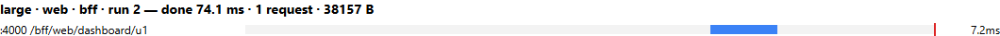
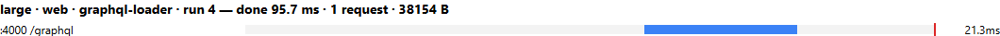

# 04 — Đo lường: Baseline vs BFF vs GraphQL, cho web và mobile

> Phần **Evidence** của bài trình bày. Mọi con số dưới đây là kết quả chạy thật (`npm run bench`, `npm run verify`), ngày 2026-10-08, máy Windows 11 của nhóm, chạy localhost.

## 1. Đếm cái gì, đếm ở đâu

| Chỉ số | Định nghĩa | Cách đo (code) |
|---|---|---|
| **Client request** | Số request `fetch` mà browser gửi tới API (không tính HTML, JS, ảnh) | Playwright đọc `performance.getEntriesByType('resource')` và lọc `initiatorType === 'fetch'` |
| **Service call** | Số HTTP request mà mỗi service **nhận** | Middleware `metrics.calls++` trong `shared/service.js`, đọc qua `GET /metrics` |
| **DB query** | Số lần gọi một hàm repository (batch `findByIds` = 1) | Wrapper `db(fn)` trong `shared/service.js` |
| **Payload** | Tổng `encodedBodySize` của các response API | Resource Timing. Service gửi `Timing-Allow-Origin: *` để browser đọc được size của response khác origin |
| **Màn hình hoàn tất** | Thời điểm `render()` ghi xong danh sách vào DOM (không chờ ảnh thumbnail tải xong), tính từ navigation start | `web/app.js` và `web/mobile.js`: `performance.mark('done'); window.__done = performance.now()` |
| **Trace** | Chuỗi call nội bộ của một request | Gateway sinh `x-request-id` và truyền xuống, mỗi service log một dòng → `results/trace-*.log` |

**Quy trình một lần đo** (`scripts/bench.js`):

1. Với mỗi tổ hợp `dataset × client × biến thể` (2 × 2 × 4 = 16 tổ hợp), **khởi động lại cả 4 process** (`scripts/lib/stack.js`).
2. Chạy 6 lần: **lần 1 = lạnh** (lần đầu sau khi khởi động lại), **lần 2 đến 6 = ấm**.
3. Trước mỗi lần, `POST /metrics/reset` cho cả 3 service. Mỗi lần mở một **browser context mới**, nên không có HTTP cache. Web dùng viewport 1280×720, mobile dùng 390×844.
4. Mở `dashboard.html` (web) hoặc `mobile.html` (mobile) với `?variant=…`, chờ `window.__done`, rồi đọc Resource Timing và `/metrics`.
5. Ghi từng lần vào `results/raw.csv`. Báo **median [min–max] của 5 lần ấm**, lần lạnh báo riêng.

Trình duyệt: Microsoft Edge (Chromium) qua Playwright. Với mỗi loại client, dữ liệu, các field hiển thị và hàm `render()` **giống hệt nhau** giữa các biến thể.

## 2. Kết quả (`results/summary.md`)

| dataset | client | variant | lạnh done (ms) | ấm done median [min–max] (ms) | client req | payload (B) | user calls/db | order calls/db | product calls/db |
|---|---|---|---|---|---|---|---|---|---|
| small | web | baseline | 240.4 | 116.2 [110.6–140.3] | 7 | 1219 | 1/1 | 1/1 | 5/5 |
| small | web | bff | 596.5 | 68 [63.1–71.5] | 1 | 1049 | 1/1 | 1/1 | 1/1 |
| small | web | graphql-naive | 169.4 | 89.7 [80.1–157.7] | 1 | 1046 | 1/1 | 1/1 | 5/5 |
| small | web | graphql-loader | 366.2 | 77.6 [71.1–98.7] | 1 | 1046 | 1/1 | 1/1 | 1/1 |
| small | mobile | baseline | 87.5 | 103.7 [83.7–261.1] | 7 | 1219 | 1/1 | 1/1 | 5/5 |
| small | mobile | bff | 521.5 | 52.1 [48.2–74.5] | 1 | 526 | 1/1 | 1/1 | 1/1 |
| small | mobile | graphql-naive | 111.3 | 56.7 [53.7–64.7] | 1 | 532 | 1/1 | 1/1 | 5/5 |
| small | mobile | graphql-loader | 394.1 | 52.9 [51.3–69.8] | 1 | 532 | 1/1 | 1/1 | 1/1 |
| large | web | baseline | 453.5 | 413.3 [346.8–511] | 202 | 46493 | 1/1 | 1/1 | 200/200 |
| large | web | bff | 128.6 | 74.1 [70.1–104.7] | 1 | 38157 | 1/1 | 1/1 | 1/1 |
| large | web | graphql-naive | 274.2 | 171.3 [155.8–402.6] | 1 | 38154 | 1/1 | 1/1 | 200/200 |
| large | web | graphql-loader | 150.6 | 95.7 [82.5–121.6] | 1 | 38154 | 1/1 | 1/1 | 1/1 |
| large | mobile | baseline | 968.1 | 417.7 [363.2–472.1] | 202 | 46493 | 1/1 | 1/1 | 200/200 |
| large | mobile | bff | 145.1 | 78.6 [63.3–97.2] | 1 | 19830 | 1/1 | 1/1 | 1/1 |
| large | mobile | graphql-naive | 290.4 | 118 [96.5–168.7] | 1 | 19836 | 1/1 | 1/1 | 200/200 |
| large | mobile | graphql-loader | 123 | 56.9 [53.6–61.6] | 1 | 19836 | 1/1 | 1/1 | 1/1 |

Bảng thô từng lần chạy: [`results/raw.csv`](../results/raw.csv) (96 dòng = 2 dataset × 2 client × 4 biến thể × 6 lần).

## 3. Waterfall

File đầy đủ: [`results/waterfall.html`](../results/waterfall.html), có 16 tổ hợp. Mỗi tổ hợp lấy lần ấm có thời gian gần median nhất ("run N" là số thứ tự của lần chạy đó). Thanh xanh là một request, **vạch đỏ là mốc màn hình hoàn tất**.

Web, small. Baseline có 7 request **nối đuôi nhau**:


BFF và GraphQL (loader) chỉ có 1 request:


Web, large. Baseline có 202 request nối tiếp, BFF và GraphQL vẫn chỉ 1 request:





Mobile, large. Vẫn 1 request, nhưng payload giảm còn khoảng 19.8 KB:


## 4. Đối chiếu dữ liệu (`results/verify.txt`)

`npm run verify` gọi cả 3 biến thể cho `u1` rồi so bằng `assert.deepStrictEqual`, trên small/large × naive/loader:

```
PASS [*] baseline == BFF / baseline == GraphQL                      (web)
PASS [*] mobile: baseline == BFF == GraphQL                         (mobile)
PASS [*] mobile: BFF và GraphQL chỉ trả id, status, product{name, thumbnail}
  5 đơn;   GraphQL naive → product calls=5,   loader → 1
  200 đơn; GraphQL naive → product calls=200, loader → 1
  payload BFF: web 1049 B → mobile 526 B (small); 38157 B → 19830 B (large)
```

Kết luận theo 3 tiêu chí đạt:
1. **Cùng dữ liệu:** 3 biến thể trả cùng dữ liệu cho cùng một user, ở cả web lẫn mobile.
2. **Mobile chỉ nhận field cần:** response mobile của BFF và GraphQL chỉ chứa `id`, `status`, `product.name`, `product.thumbnail`.
3. **Sửa N+1:** sau khi dùng DataLoader, số call tới Product không tăng theo số đơn.

## 5. Nhận xét (chỉ dựa trên số liệu ở trên)

1. **Client request**: baseline là 2 + N (7 với small, 202 với large) **cho cả web lẫn mobile**. BFF và GraphQL luôn là **1**.
2. **Product calls**: baseline và GraphQL naive **tăng tuyến tính** (5 → 200). BFF và GraphQL loader **luôn bằng 1**.
3. **Payload, mobile so với web**: BFF và GraphQL mobile nhận **khoảng 52% số byte** của bản web (19.8 KB so với 38.2 KB ở large). Baseline mobile vẫn nhận **46.5 KB, y như web**, vì REST trả cả object rồi client mới cắt bớt. Đây là over-fetching, và mobile nhận nhiều hơn gấp 2,3 lần lượng dữ liệu nó thực sự cần.
4. **Thời gian, bộ large** (median ấm):
   - Web: baseline 413 ms, GraphQL naive 171 ms, GraphQL loader 96 ms, BFF 74 ms.
   - Mobile: baseline 418 ms, GraphQL naive 118 ms, BFF 79 ms, GraphQL loader 57 ms.

   Baseline chậm nhất vì 202 request phải đi tuần tự từ browser. GraphQL naive chậm hơn loader khoảng 1,8–2,1 lần.
5. **Bộ small: chênh lệch thời gian nằm trong nhiễu.** Ví dụ ở mobile, BFF (52.1 ms), GraphQL loader (52.9 ms) và GraphQL naive (56.7 ms) gần như bằng nhau, khoảng min–max chồng lên nhau. **Không kết luận được về tốc độ trên bộ small.** Lợi ích ở đây là số request, số call và payload.
6. **Lần lạnh dao động mạnh**: từ 87 ms (small mobile baseline) đến 968 ms (large mobile baseline). Riêng BFF và GraphQL loader ở small có lần lạnh 366–597 ms. Lần lạnh đo cả chi phí khởi động JIT của Node, kết nối TCP đầu tiên và parse module của browser. Với chỉ 1 mẫu cho mỗi tổ hợp, không nên so sánh lần lạnh giữa các biến thể.
7. **BFF và GraphQL loader** có số call giống nhau, và thời gian thay phiên nhau dẫn trước: BFF nhanh hơn ở web large, GraphQL nhanh hơn ở mobile large. Chênh lệch nằm trong khoảng min–max của nhau.

## 6. Chạy lại

```powershell
npm run verify               # đối chiếu dữ liệu (web + mobile) + N+1 + lỗi → results/verify.txt
npm run bench                # đo → results/raw.csv, summary.md, waterfall.html (khoảng 3–4 phút)
$env:RUNS=11; npm run bench  # 1 lạnh + 10 ấm
```

Trước khi chạy hai lệnh trên, cần tắt `npm start`, vì script tự khởi động stack trên cổng 4000–4003.

Giới hạn của phép đo xem ở `06-tradeoffs.md`.
