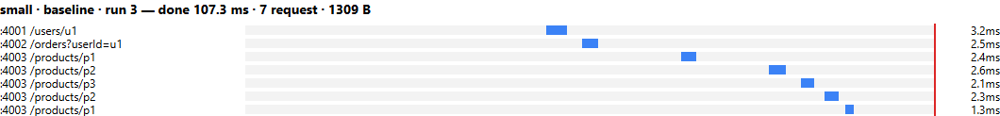
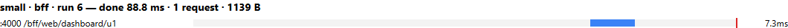
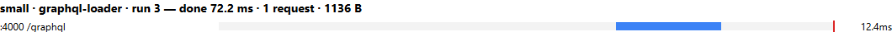
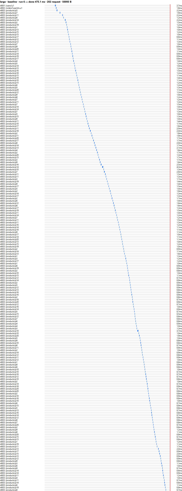
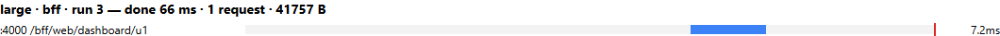

# 04 — Đo lường: Baseline vs BFF vs GraphQL

> Phần **Evidence** của bài trình bày. Mọi con số dưới đây là kết quả chạy thật (`npm run bench`, `npm run verify`), ngày 2026-10-08, máy Windows 11 của nhóm, chạy localhost.

## 1. Đếm cái gì, đếm ở đâu

| Chỉ số | Định nghĩa | Cách đo (code) |
|---|---|---|
| **Client request** | Số request `fetch` mà browser gửi tới API (không tính HTML/JS tĩnh) | Playwright đọc `performance.getEntriesByType('resource')` và lọc `initiatorType === 'fetch'` |
| **Service call** | Số HTTP request mà mỗi service **nhận** | Middleware `metrics.calls++` trong `shared/service.js`, đọc qua `GET /metrics` |
| **DB query** | Số lần gọi một hàm repository (batch `findByIds` = 1) | Wrapper `db(fn)` trong `shared/service.js` |
| **Payload** | Tổng `encodedBodySize` của các response API | Resource Timing. Service gửi `Timing-Allow-Origin: *` để browser đọc được size của response khác origin |
| **Màn hình hoàn tất** | Thời điểm `render()` ghi xong bảng vào DOM, tính từ navigation start | `web/app.js`: `performance.mark('done'); window.__done = performance.now()` |
| **Trace** | Chuỗi call nội bộ của một request | Gateway sinh `x-request-id` và truyền xuống, mỗi service log một dòng → `results/trace-*.log` |

**Quy trình một lần đo** (`scripts/bench.js`):

1. Với mỗi tổ hợp `dataset × biến thể`, **khởi động lại cả 4 process** (`scripts/lib/stack.js`).
2. Chạy 6 lần: **lần 1 = lạnh** (lần đầu sau khi khởi động lại), **lần 2 đến 6 = ấm**.
3. Trước mỗi lần, `POST /metrics/reset` cho cả 3 service. Mỗi lần mở một **browser context mới**, nên không có HTTP cache.
4. Mở `dashboard.html?variant=…`, chờ `window.__done`, rồi đọc Resource Timing và `/metrics`.
5. Ghi từng lần vào `results/raw.csv`. Báo **median [min–max] của 5 lần ấm**, lần lạnh báo riêng.

Trình duyệt: Microsoft Edge (Chromium) qua Playwright. Dữ liệu, các field hiển thị và hàm `render()` **giống hệt nhau** giữa các biến thể.

## 2. Kết quả (`results/summary.md`)

| dataset | variant | lạnh done (ms) | ấm done median [min–max] (ms) | client req | payload (B) | user calls/db | order calls/db | product calls/db |
|---|---|---|---|---|---|---|---|---|
| small | baseline | 151.2 | 107.3 [100.1–143.1] | 7 | 1309 | 1/1 | 1/1 | 5/5 |
| small | bff | 122.9 | 88.8 [58.7–156.4] | 1 | 1139 | 1/1 | 1/1 | 1/1 |
| small | graphql-naive | 145.6 | 63.8 [60.7–71] | 1 | 1136 | 1/1 | 1/1 | 5/5 |
| small | graphql-loader | 123 | 72.2 [70.1–87] | 1 | 1136 | 1/1 | 1/1 | 1/1 |
| large | baseline | 821.8 | 475.1 [427.7–566.2] | 202 | 50093 | 1/1 | 1/1 | 200/200 |
| large | bff | 125.1 | 66 [59.4–87.2] | 1 | 41757 | 1/1 | 1/1 | 1/1 |
| large | graphql-naive | 335.6 | 146.2 [121.9–236.6] | 1 | 41754 | 1/1 | 1/1 | 200/200 |
| large | graphql-loader | 196.9 | 76.8 [69–140.2] | 1 | 41754 | 1/1 | 1/1 | 1/1 |

Bảng thô từng lần chạy: [`results/raw.csv`](../results/raw.csv) (48 dòng = 2 dataset × 4 biến thể × 6 lần).

## 3. Waterfall

File đầy đủ: [`results/waterfall.html`](../results/waterfall.html). Mỗi tổ hợp lấy lần ấm có thời gian gần median nhất. Thanh xanh là một request, **vạch đỏ là mốc màn hình hoàn tất**.

Baseline, small: 7 request **nối đuôi nhau**:



BFF, small: 1 request:



GraphQL (loader), small:



Large: baseline có 202 request nối tiếp, BFF và GraphQL vẫn chỉ 1 request:





## 4. Đối chiếu dữ liệu (`results/verify.txt`)

`npm run verify` gọi cả 3 biến thể cho `u1` rồi so bằng `assert.deepStrictEqual`:

```
PASS [small, GQL_MODE=naive]  baseline == BFF / baseline == GraphQL
PASS [small, GQL_MODE=loader] baseline == BFF / baseline == GraphQL
PASS [large, GQL_MODE=naive]  baseline == BFF / baseline == GraphQL
PASS [large, GQL_MODE=loader] baseline == BFF / baseline == GraphQL
  5 đơn;   GraphQL naive → product calls=5,   loader → 1
  200 đơn; GraphQL naive → product calls=200, loader → 1
```

Như vậy **3 biến thể trả cùng dữ liệu dashboard cho cùng một user** (tiêu chí đạt 1), và **sau khi sửa N+1, số call tới Product không tăng theo số đơn** (tiêu chí đạt 3).

## 5. Nhận xét (chỉ dựa trên số liệu ở trên)

1. **Client request**: baseline là 2 + N (7 với small, 202 với large). BFF và GraphQL luôn là **1**.
2. **Product calls**: baseline và GraphQL naive **tăng tuyến tính** (5 → 200). BFF và GraphQL loader **luôn bằng 1**.
3. **Thời gian, bộ large**: baseline 475 ms, GraphQL naive 146 ms, GraphQL loader 77 ms, BFF 66 ms (median ấm). Baseline chậm nhất vì 202 request phải đi tuần tự từ browser. GraphQL naive nhanh hơn baseline vì 200 call nằm trong mạng nội bộ và chạy **song song**, nhưng vẫn chậm gần gấp đôi loader.
4. **Thời gian, bộ small: chênh lệch nằm trong nhiễu.** GraphQL naive (63.8 ms) còn nhanh hơn loader (72.2 ms). Khoảng min–max của các biến thể chồng lên nhau, ví dụ BFF dao động 58.7–156.4. Ở localhost với 5 đơn, chi phí 5 call song song ≈ 1 call. **Không kết luận được về tốc độ trên bộ small.** Lợi ích ở đây là số call và số DB query.
5. **Lạnh vs ấm**: lần lạnh luôn chậm hơn (khởi động JIT của Node, kết nối TCP và module của browser lần đầu). Rõ nhất ở large baseline: 822 ms lạnh so với 475 ms ấm.
6. **Payload**: BFF và GraphQL nhỏ hơn baseline (41.7 KB so với 50.1 KB ở large). Baseline nhận về **toàn bộ** object product, kể cả `category` và lặp lại theo từng đơn, trong khi BFF và GraphQL chỉ trả field cần hiển thị. Lưu ý BFF và GraphQL vẫn lặp product trong mỗi đơn, vì view-model không chuẩn hóa.
7. **BFF và GraphQL loader** có số call giống nhau. BFF nhỉnh hơn một chút vì gọi user và orders song song, còn GraphQL gọi nối tiếp theo cây resolver (xem `03-graphql-n+1.md`). Mức chênh này nhỏ so với nhiễu.

## 6. Chạy lại

```powershell
npm run verify               # đối chiếu dữ liệu + N+1 + lỗi → results/verify.txt
npm run bench                # đo → results/raw.csv, summary.md, waterfall.html
$env:RUNS=11; npm run bench  # 1 lạnh + 10 ấm
```

Trước khi chạy hai lệnh trên, cần tắt `npm start`, vì script tự khởi động stack trên cổng 4000–4003.

Giới hạn của phép đo xem ở `06-tradeoffs.md`.
