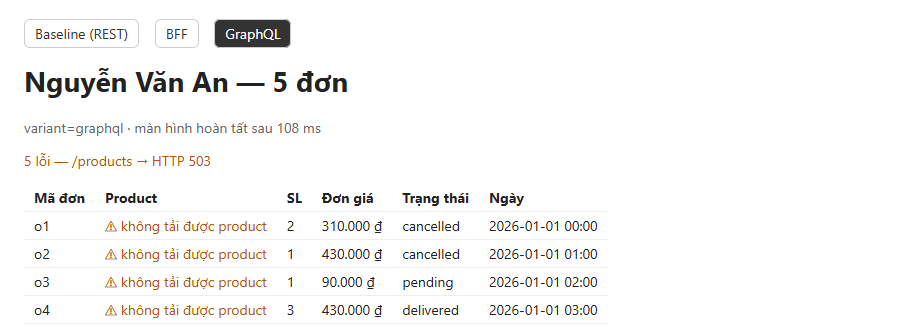

# 05 — Khi Product Service chậm hoặc lỗi

> Phần **Evidence** (độ bền) của bài trình bày.

## 1. Policy đã chọn: dữ liệu một phần, có đánh dấu lỗi

Áp dụng **chung cho BFF và GraphQL**, baseline cũng làm giống vậy:

- Gọi Product Service với **timeout 1000 ms** (`AbortSignal.timeout`, hằng `PRODUCT_TIMEOUT_MS` trong `shared/contract.js`).
- Product lỗi hoặc timeout thì **vẫn trả HTTP 200** gồm user và danh sách đơn đầy đủ. Mỗi đơn có `product: null` và **một lỗi cho mỗi đơn**:
  ```json
  { "path": ["user", "orders", 0, "product"], "message": "/products → HTTP 503" }
  ```
- **Không** thay tên hoặc giá product bằng giá trị giả. UI hiển thị `⚠ không tải được product`.
- **Product id không tồn tại** (batch trả về thiếu id): BFF và DataLoader cũng thêm lỗi `"/products/pX → HTTP 404"` cho đúng đơn đó, giống baseline và GraphQL naive. DataLoader làm được việc này bằng cách trả `Error` ở đúng vị trí trong mảng kết quả. Có test `product không tồn tại → …`.
- User hoặc Order lỗi thì không có gì để hiển thị: BFF trả 404 (user không tồn tại) hoặc 502. GraphQL trả `user: null` hoặc `errors`.

**Vì sao chọn partial thay vì thất bại toàn bộ:** tên product chỉ là phần bổ sung. User vẫn xem được danh sách đơn, trạng thái, số lượng và đơn giá (`unitPrice` là dữ liệu thật của Order Service, tức giá lúc đặt hàng). Timeout cũng chặn thời gian chờ tối đa, nên một service chậm không kéo cả màn hình chậm theo.

## 2. Cách gây lỗi

Middleware trong `services/product/index.js`, bật bằng biến môi trường:

```js
app.use('/products', async (req, res, next) => { // gây lỗi có chủ đích
  if (fault === 'error') return res.status(503).json({ error: 'product service unavailable (injected)' });
  if (fault === 'slow') await sleep(delayMs);
  next();
});
```

| Biến | Giá trị | Ý nghĩa |
|---|---|---|
| `PRODUCT_FAULT` | `none` (mặc định), `error`, `slow` | `error` trả 503 ngay; `slow` ngủ trước khi trả lời |
| `PRODUCT_DELAY_MS` | mặc định `2000` | thời gian ngủ của `slow`, lớn hơn timeout 1000 ms |

```powershell
$env:PRODUCT_FAULT='error'; npm start      # hoặc 'slow'
Remove-Item Env:PRODUCT_FAULT              # tắt
```

## 3. Hiện thực

**BFF** (`gateway/bff.js`): bắt lỗi của lần gọi batch, rồi tự tạo `errors[]` có cùng hình dạng với GraphQL:

```js
try { byId = new Map((await clients.getProductsByIds(ids)).map((p) => [p.id, p])); }
catch (e) { failure = e; }
...
errors: failure ? orders.map((_, i) => productError(i, failure.message)) : [],
```

**GraphQL** (`gateway/graphql.js`): dùng cơ chế chuẩn của GraphQL. `Order.product` **nullable**, nên khi resolver ném lỗi, field đó thành `null` và lỗi vào `errors[]` kèm `path`. Hàm batch của DataLoader ném lỗi thì mọi `load()` trong lô đều reject, nên có một lỗi cho mỗi đơn. Đặt `maskedErrors: false` để giữ message thật, nếu không yoga sẽ đổi thành "Unexpected error.".

**Baseline** (`web/fetchers.js`): bắt lỗi từng request product, cùng timeout 1000 ms.

Cả ba biến thể đều dùng `getJson()` trong `shared/contract.js`, nên message lỗi có cùng định dạng: `<path> → HTTP <status>` hoặc `<path> timeout after 1000ms`.

## 4. Evidence

### `npm run verify`, phần lỗi (`results/verify.txt`), gọi từ Node

```
[fault=error] baseline:    8ms, products=[null×5], errors=5, "/products/p1 → HTTP 503"
[fault=error] bff:        42ms, products=[null×5], errors=5, "/products → HTTP 503"
[fault=error] graphql:    39ms, products=[null×5], errors=5, "/products → HTTP 503"
[fault=slow]  baseline: 5031ms, products=[null×5], errors=5, "/products/p1 timeout after 1000ms"
[fault=slow]  bff:      1073ms, products=[null×5], errors=5, "/products timeout after 1000ms"
[fault=slow]  graphql:  1043ms, products=[null×5], errors=5, "/products timeout after 1000ms"
PASS × 6: giữ user + đơn, product null, 1 lỗi/đơn
```

### Trên browser thật (`npm run smoke`, Edge)

```
== PRODUCT_FAULT=error
baseline | Nguyễn Văn An — 5 đơn | … hoàn tất sau 186 ms  | rows=5 | 5 lỗi — /products/p1 → HTTP 503
bff      | Nguyễn Văn An — 5 đơn | … hoàn tất sau 155 ms  | rows=5 | 5 lỗi — /products → HTTP 503
graphql  | Nguyễn Văn An — 5 đơn | … hoàn tất sau 97 ms   | rows=5 | 5 lỗi — /products → HTTP 503
== PRODUCT_FAULT=slow
baseline | Nguyễn Văn An — 5 đơn | … hoàn tất sau 5165 ms | rows=5 | 5 lỗi — /products/p1 timeout after 1000ms
bff      | Nguyễn Văn An — 5 đơn | … hoàn tất sau 1114 ms | rows=5 | 5 lỗi — /products timeout after 1000ms
graphql  | Nguyễn Văn An — 5 đơn | … hoàn tất sau 1111 ms | rows=5 | 5 lỗi — /products timeout after 1000ms
```



## 5. Nhận xét

- **Khi Product chậm**: baseline mất **khoảng 5 s** vì phải chờ 5 timeout nối tiếp (1 s × N đơn, và sẽ khoảng 200 s với bộ large). BFF và GraphQL chỉ mất **khoảng 1,1 s** vì chỉ có 1 call batch nên chỉ chờ 1 timeout. Đây là lợi ích phụ của batching.
- Ba biến thể giữ **cùng hình dạng lỗi** (`path` theo từng đơn), nên UI dùng chung một cách hiển thị.
- **Message lỗi khác nhau giữa các biến thể**: baseline và GraphQL naive báo theo từng product (`/products/p1 → …`), còn BFF và loader báo theo batch (`/products → …`). `verify` chỉ so `path`, không so message.
- **GraphQL khi User hoặc Order sập**: `data.user` thành `null` kèm `errors`. Fetcher web phân biệt trường hợp này với "không tìm thấy user" (null mà không có lỗi) và hiển thị `Lỗi: …` giống BFF.
- **User và Order không có timeout**: chỉ Product có timeout. Nếu User hoặc Order chậm thì BFF và GraphQL cũng chậm theo.
- **Giới hạn của policy**: không retry, không circuit breaker, không cache product cũ. Product Service sập thì mọi request đều chờ hết 1 s timeout (với lỗi `slow`). Circuit breaker sẽ giúp trả lỗi ngay.
